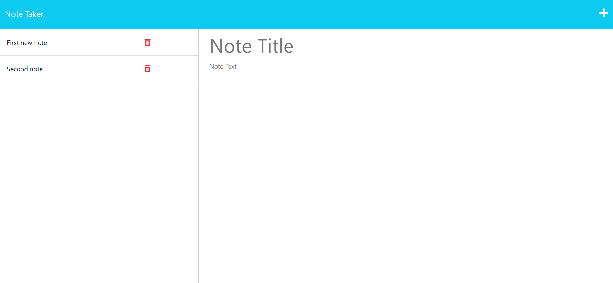

# Note Taker with express.js

## Description
This is a web application that uses express.js to handle GET and POST request. These requests are handled by a backend server that stores your notes in a JSON file as a database. This application is to show my understanding in express.js along with deploying my app with heroku.

## Table of Contents
* [Installation](#installation)
* [Usage](#usage)
* [License](#license)
* [Contributing](#contributing)
* [Tests](#tests)
* [Questions](#questions)

## Installation
To install the application, go to the github repository at [this link](https://github.com/BlakeE-37/Note-Taker), and clone the repository.

## Usage
To use the app you can clone the repository and run the app locally or you can go to the hosted site at [this link](https://peaceful-castle-40527.herokuapp.com/notes). To use the app press the 'Get Started' button to be taken to the applications main screen. Then in the right hand column type in a Title and Text for your note and a save button will appear, press this button to save your note. Click on the note in the left hand column to see the Text for your note.

## Helpfull Links 
[Heroku Deployment](https://coding-boot-camp.github.io/full-stack/heroku/heroku-deployment-guide)

- Some code was corrected or added with the help of my tutor **Andrew Tirpok**

## License
[none]()

## Contributing
There is no contributing to this project at this time.

## Tests
There is no tests for the application at this time.

## Questions
[My Github Profile](https://github.com/BlakeE-37)  
For Questions, you can email me at [hollibe2000@gmail.com](mailto:hollibe2000@gmail.com)
